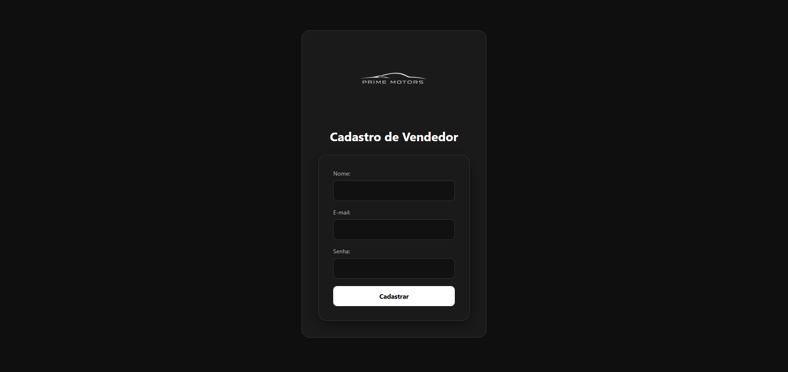
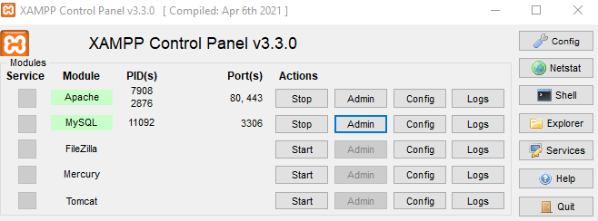
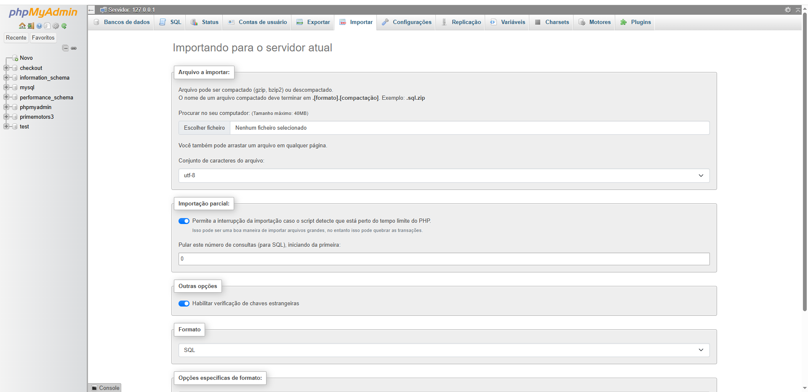
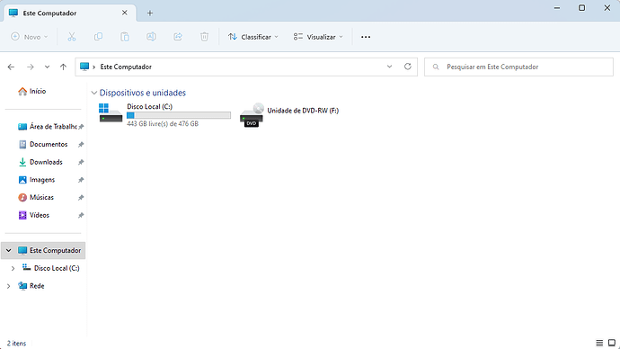
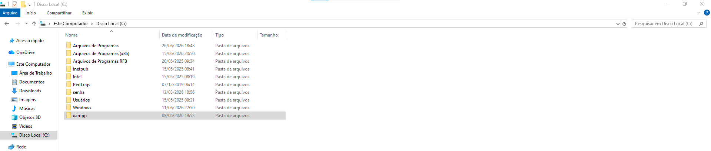
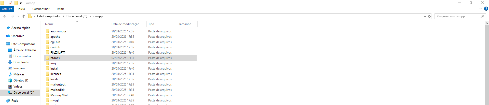

# **Prime Motors -  Sistema web de Loja de Carros 🚗**

Sistema web desenvolvido em PHP utilizando padrão de arquitetura MVC (MODELS-VIEWS-CONTROLLERS) para gerenciamento de uma loja de carros.

## funcionalidades 🛠️

## 🔐 Sistema de Login

O sistema possui uma tela de autenticação para controlar o acesso dos usuários. O login é realizado por meio de e-mail e senha cadastrados no banco de dados MySQL.
Após a validação dos dados, o usuário é redirecionado para a dashboard do sistema, onde poderá acessar as funcionalidades disponíveis.

## 📝 Cadastro de Usuários

O sistema permite o cadastro de novos usuários por meio de um formulário contendo informações básicas, como nome, e-mail e senha.
Os dados informados são armazenados no banco de dados MySQL e posteriormente utilizados para autenticação e acesso ao sistema.

## 📊 Dashboard

O projeto conta com um sistema de Dashboard, onde o usuário pode observar informações como:

-Vendas (mês)

-Entradas (Mês)

-Nível do estoque

-Produtos 

## Tecnologias utilizadas

**PHP**

**MySql**

**HTML5**

**CSS3**

**XAMPP**

**GitHub**

**Figma**

**Excalidraw**

## 🚀 Como executar o projeto

1. **Instalar XAMPP** (https://www.apachefriends.org/pt_br/index.html)

2. **Iniciar Apache e MySQL**

3. **Importar o banco de dados no phpMyAdmin**

4. **Colocar o projeto em:**
   C:\xampp\htdocs\lojadecarros

**Entre na pasta "xampp"**

**Depois na pasta "htdocs" e coloque a pasta do projeto**

5. **Depois abra no seu navegador:**
   http://localhost/lojadecarros/

   ## 👨‍💻 Desenvolvedores

   **Eduardo Cavalcante Marques Santos**

   **Gabriel Araújo Pimenta Vieira**

   **Bryan Isaac Ribeiro Moura**

   **Kauã Gustavo Rodrigues de Oliveira**

   **Gustavo Furtado de Souza e Silva**
